# git Workflows

**The lifecycle of a change**

---

## Why Talk About Workflows?

- git gives you the building blocks: branches, merge, rebase, …
- git does **not** tell you how a team should use them
- A workflow is a **team agreement**; the shape of your history follows from it
- Many named workflows exist, but they all answer the same two questions

---

## The Example

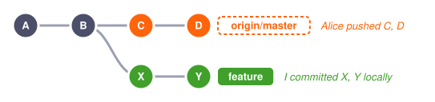

| | Who | Change |
|---|---|---|
| `C` | Alice | rename `charge()` to `chargeCents()`, update all callers |
| `D` | Alice | fix rounding of invoice totals in `Invoice.java` |
| `X` | Me | add `refund()`, which calls `charge()` |
| `Y` | Me | change the format of invoice totals in `Invoice.java` |

---

## Two Questions Every Workflow Answers

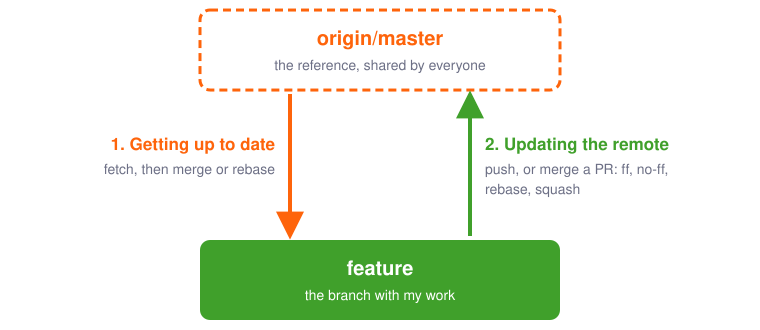

---

## The Feature Branch

- Any branch that started from `master` and carries my work back to it
- Even after the two have diverged
- It can be:
  - my local `master` itself
  - a local topic branch, never pushed
  - a branch pushed for a pull request, or in a fork
  - a long-lived branch: `develop`, a team branch, …

Different workflows, same two questions, same mechanics.

---

# 1. Getting Up to Date

**Bringing new upstream commits into my feature branch**

---

## Option 1: Merge

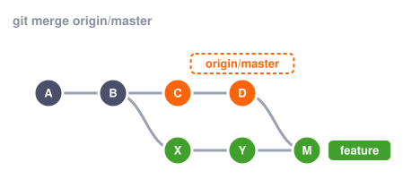

- `git merge origin/master`
- A new commit `M` with 2 parents; local commits are untouched
- Every catch-up adds a merge commit

---

## Option 2: Rebase

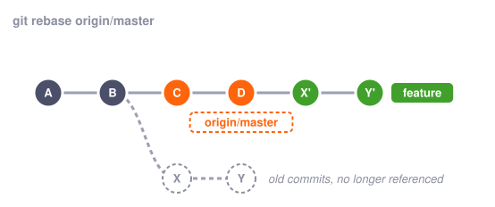

- `git rebase origin/master`
- Local commits are **replayed** on top of `D`: new commits `X'`, `Y'`
- As if I had started from `D`; fine as long as nobody else has `X`, `Y`

---

## Git Conflict

`D` and `Y` touch the same lines: a git conflict

- **Merge** stops once, with both sides of `Invoice.java` marked
  - fix, `git add Invoice.java`, `git commit`
- **Rebase** replays `X` (clean), then stops at `Y`
  - fix, `git add Invoice.java`, `git rebase --continue`
  - during a rebase `--ours` is `origin/master` and `--theirs` is my commit
- Lost? `git merge --abort` / `git rebase --abort`
- `git config merge.conflictStyle zdiff3` also shows the common ancestor

---

## Semantic Conflict

`C` and `X` don't touch the same lines: no git conflict

```java
// Billing.java, after C: renamed, every existing caller updated
void chargeCents(Account account, long cents) { ... }

// Refunds.java, from X: written against the old name
void refund(Account account, long amount) {
    billing.charge(account, -amount);
}
```

- Merge and rebase both "succeed": git merges **text**, not meaning
- The result doesn't compile: a **semantic conflict**
- Worse: had `C` only changed the unit, keeping the signature, it would compile
  and run, wrongly
- Only a build, the tests or a careful reviewer find it: **test after catching
  up**

---

# 2. Updating `origin/master`

**Bringing my local commits into the upstream branch**

---

## If I Don't Get Up to Date: Push

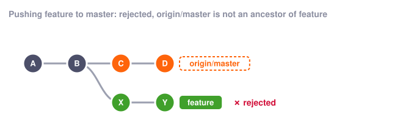

- Pushing to `master` is rejected: it would throw away `C`, `D`
- `--force` overwrites anyway: `C`, `D` vanish from `origin/master`
- `--force-with-lease` only refuses if `origin/master` moved since my fetch:
  here it would still drop `C`, `D`. Force only my own rewritten branches

---

## If I Merge First

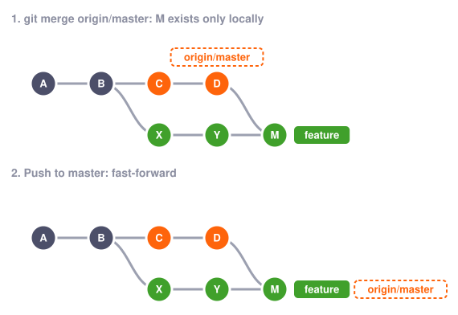

- `M` exists only locally: I can build and test it before pushing
- Pushing to `master` is then a fast-forward to exactly what I tested
- The team's history now contains my catch-up merge, with my side first

---

## If I Rebase First

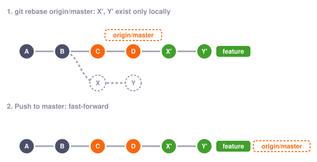

- `X'`, `Y'` exist only locally: I can build and test them before pushing
- Pushing to `master` is then a fast-forward to exactly what I tested
- The team's history stays linear

---

## Pull Request

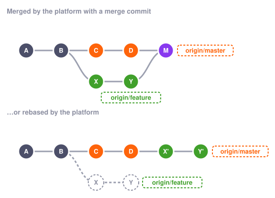

- Only **git conflicts** stop it: the `C`/`X` semantic conflict lands on `master`
- CI may have tested only my branch, or an older combination
- A **merge queue** closes the gap: it tests the result before `master` moves

---

## Two Approaches

### Integrate First: Test Locally, Then Update `origin/master`

- Get up to date (merge or rebase), build, test
- `origin/master` only receives what I tested: a fast-forward, or a merge
  commit that brings nothing new from upstream
- If `origin/master` moved in the meantime: repeat

### Integrate on the Fly: Update `origin/master` from an Outdated Branch

- The merge happens on the fly, allowed whenever there is no git conflict
- Faster, but a semantic conflict can break `master`

---

## Ensuring `master` Never Breaks

- Goal: `master` always builds and passes the tests, so test what lands on it
- Require branches to be up to date before merging
- CI on the merge result, not only on the branch
- A **merge queue**: tests each change on top of the latest `master`
- Smaller, more frequent integrations ➔ fewer conflicts of both kinds

---

# 3. History Shapes

**What `git log --graph` looks like, depending on how the team integrates**

---

## Circuit-Board History

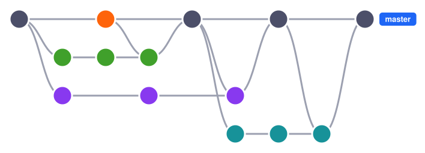

Merge commits everywhere: catch-up merges into features, features into `master`

- **+** Records what really happened; never rewrites commits, safe when shared
- **−** Hard to read: crossing lines, catch-up merges add noise
- **−** `git log` interleaves features; `bisect` and reverts must handle merges

---

## Linear History


Rebase (or squash) before every update, then fast-forward

- **+** Easy to read: `git log` tells one story
- **+** `git bisect` and reverts work commit by commit
- **−** Rewrites commits: rebased intermediate commits were never tested
- **−** Features lose their boundaries (unless squashed into one commit each)

---

## Semi-Linear History

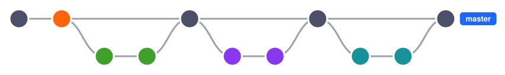

Rebase each feature, then merge it with `--no-ff`

- **+** As readable as linear, but each feature stays grouped
- **+** `git log --first-parent`: one entry per feature; revert a whole feature
  by reverting its merge
- **−** Still rewrites commits, plus one merge commit per feature
- **−** Each feature must be up to date before it's merged

---

# 4. Workflow Examples on GitHub

**The same choices, as repository settings**

---

## GitHub: Update Branch

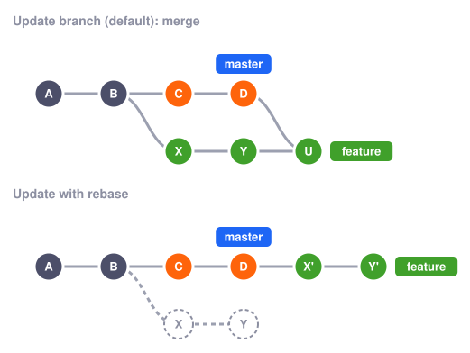

- **Update branch** (default): a catch-up merge, done by GitHub
- **Update with rebase** (dropdown): rewrites `feature`; local copies need a reset
- Either way, checks run again before merging

---

## GitHub: Normal Merge

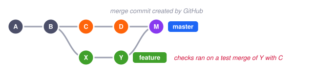

- **Create a merge commit**: `git merge --no-ff` done by GitHub, even if
  `feature` is behind `master`
- Checks ran on a test merge with `master` **as it was back then**
- History: circuit-board

---

## GitHub: Squash and Merge, Rebase and Merge

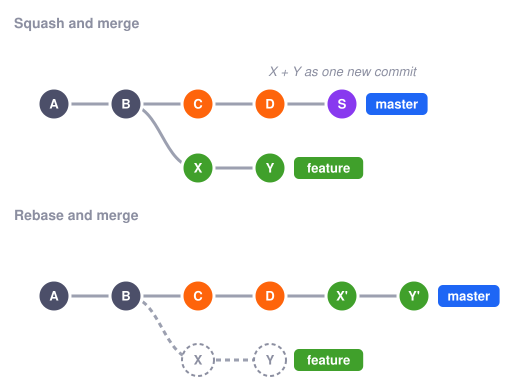

- Both done on the fly, even if `feature` is behind `master`
- **Rebase and merge** always creates new commits, even when not needed
- History: linear; with squash, one commit per pull request

---

## GitHub: A Longer-Lived Pull Request

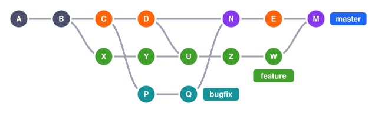

- `U`: **Update branch** merges `C`, `D` into `feature`; work goes on with `Z`,
  `W`
- Meanwhile `bugfix` is merged (`N`) and `E` is pushed
- `M`: **Create a merge commit** on top of `N`, `E`, which `feature` never
  contained: maybe never tested together, and the lines cross

---

## GitHub: Up to Date and Linear History

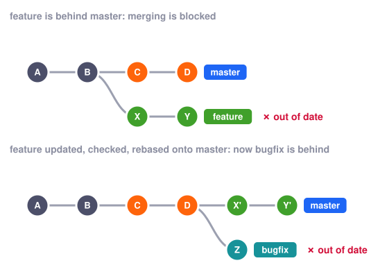

- **Require branches to be up to date before merging** + **Require linear
  history**: `master` only gets tested commits, in a straight line
- Cost: every merge outdates the others: update, wait for CI, race again

---

## GitHub: Merge Queue

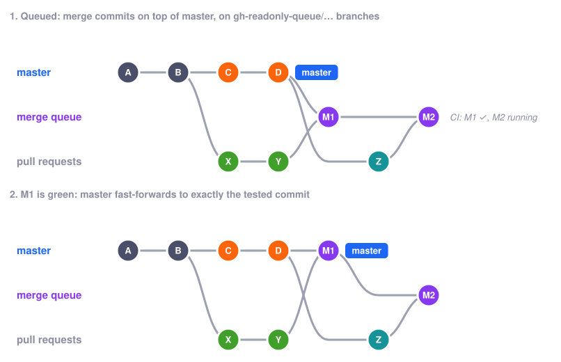

- **Merge when ready**: GitHub merges the pull request on top of `master` + the
  entries ahead
- CI runs on that commit (`merge_group`); green ➔ `master` fast-forwards to it
- What lands is what was tested; public organization repos or Enterprise Cloud

<!--
Merge method is configurable (merge, squash, rebase); the diagram shows "merge".
GitHub docs: the temporary branch contains the target branch plus the queued pull
requests, and "will be merged in to the target branch" once checks pass.
Caveat: on 2026-04-23, merge queues using squash with more than one pull request
per group produced wrong commits that reverted other changes (658 repositories,
2,092 pull requests). Merge and rebase methods were not affected.
https://github.blog/news-insights/company-news/an-update-on-github-availability/
-->


---

## Takeaways

- Two directions: **getting up to date**, **updating the remote**
- Merge, rebase, fast-forward or not: together they decide the **shape** of the
  history, circuit-board, linear or semi-linear
- Conflicts happen either way, and no git conflict ≠ no conflict: **test the
  combined result**
- Agree as a team: how you catch up, how `master` gets updated, which history
  you want, who tests what
- `git config --global pull.ff only`: never merge without noticing
- `git push --force-with-lease`, never plain `--force`

---

## References

- Pro Git, _Git Branching_ and _Distributed Git_: <https://git-scm.com/book>
- GitHub merge methods:
  <https://docs.github.com/en/repositories/configuring-branches-and-merges-in-your-repository/configuring-pull-request-merges/about-merge-methods-on-github>
- GitLab merge methods: <https://docs.gitlab.com/user/project/merge_requests/methods/>
- Martin Fowler, _Patterns for Managing Source Code Branches_:
  <https://martinfowler.com/articles/branching-patterns.html>
- Practice: <https://learngitbranching.js.org/>

---

**Thank you!**

> Questions? Remarks? Discussion welcome!
